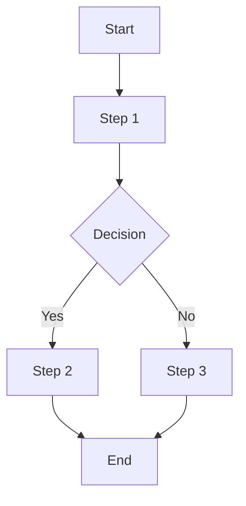
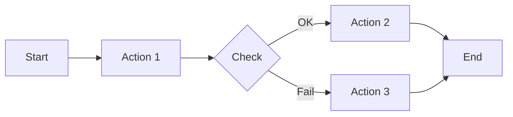

# Flowchart Diagram

```mermaid
graph TD;
    A[Start] --> B[Step 1]
    B --> C{Decision}
    C -->|Yes| D[Step 2]
    C -->|No| E[Step 3]
    D --> F[End]
    E --> F[End]
```

### This is what i got

``` mermaid
graph LR;
    X[Start] --> Y[Action 1]
    Y --> Z{Check}
    Z -->|OK| W[Action 2]
    Z -->|Fail| V[Action 3]
    W --> U[End]
    V --> U[End]

```